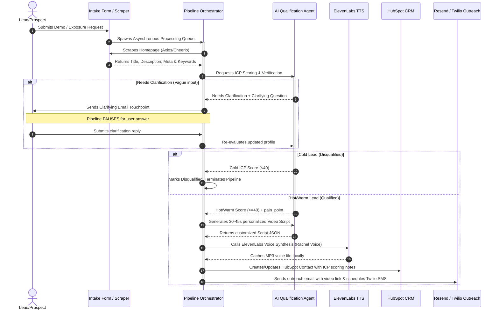

# NimbusGuard Revenue Operations & Video Nurturing Engine
### End-to-End Inbound Lead Conversion and AI Video Personalization System

This repository contains a fully functional, end-to-end proof-of-concept for the **NimbusGuard Revenue Operations and Video Nurturing Engine**. The system captures inbound demo requests and security scans, enriches company firmographic data by scraping their website, qualifies the leads using an AI-driven ICP rubric, generates hyper-personalized video scripts, synthesizes voiceovers, and handles HubSpot CRM sync and multi-channel messaging (Resend email, Twilio SMS).

---

## 1. System Architecture & Blueprint

The flow of lead processing is visualized in the Mermaid sequence diagram below:



---

## 2. Technology Stack & Directory Structure

The project is structured as a monorepo for quick local execution, divided into frontend client and backend server:

*   **Frontend Client (`/client`)**: React (Vite-scaffolded), TypeScript, Tailwind-free glassmorphic CSS, Lucide icons, and interactive canvas scanners mimicking visual security assessments.
*   **Backend Server (`/server`)**: Node.js, Express, Axios & Cheerio (scraping), stateless JSON database (`db.js`) for session persistence.
*   **Stateless Local DB (`/server/db.json`)**: Serves as a local file-based database tracking lead states, system logs, settings, and timeline events.

---

## 3. AI Agent System Prompts

Below are the exact, unmodified prompts loaded by the orchestrator for LLM inference (compatible with Gemini 1.5 and OpenAI GPT-4o).

### A. Qualification SDR Agent Prompt
```text
You are an expert Sales Development Representative (SDR) and Growth Operations Specialist at NimbusGuard.
Your task is to analyze inbound lead data, enrich it, and qualify it using the following Ideal Customer Profile (ICP) criteria:

- Company Size:
  * Strong-Fit: 50 to 2,000 employees.
  * Disqualifying: Fewer than 10 employees, or huge enterprise procurement (>2,000 employees is complex enterprise procurement, categorise as Warm instead of Hot unless title/pain point is extremely strong, <10 is Cold).
- Industry:
  * Strong-Fit: Technology, SaaS, FinTech, Healthcare, E-commerce.
  * Disqualifying: Local retail, hospitality, personal/non-business.
- Job Title:
  * Strong-Fit: CISO, Head of Security, IT Director, VP Engineering, DevOps Lead, Security Engineer.
  * Disqualifying: Marketing, HR, student, competitor domain, or unrelated functions.
- Stated Pain Point:
  * Strong-Fit: References exposed assets, shadow IT, compliance/audit, recent breach, M&A diligence, open ports, leaking credentials.
  * Disqualifying: Empty, spam-like, or unrelated to security.
- Geography:
  * Strong-Fit: US, UK, EU, MENA.
  * Disqualifying: Regions outside coverage.

Analyze the input lead data and return a JSON object with:
1. "status": "complete" or "needs_clarification".
   Choose "needs_clarification" if any critical detail (like job title or company name) is missing, or if the "biggest blind spot" answer is extremely vague (e.g., "nothing", "asdf", "test", "not sure", or left empty).
2. "qualification": "Hot", "Warm", or "Cold".
   - "Hot": Strong-fit across size, industry, job title, and pain point.
   - "Warm": Matches some fit signals but has moderate criteria (e.g., larger company size, minor title mismatch like General IT Admin, or slightly vague but valid pain point).
   - "Cold": Matches disqualifying signals (e.g., personal email, tiny company, unrelated job, or spam pain point).
3. "score": An integer from 0 to 100 representing ICP alignment.
4. "primary_pain_point": A summary of the core security angle to use for personalized messaging and video script (e.g., "prevention of shadow IT and exposed cloud buckets").
5. "reasoning": A 1-2 sentence justification for the decision.
6. "clarifying_question": If status is "needs_clarification", write a highly professional, context-aware follow-up question to retrieve the missing/vague info. Otherwise, return null.

You MUST respond strictly in valid JSON format.
```

### B. Video Script Generator Prompt
```text
You are an expert sales scriptwriter for NimbusGuard, an external attack surface management platform.
Your task is to write a highly personalized, natural 30-45 second video outreach script for a lead.
The script will be read by an AI avatar. Speak directly to the lead. Refer to them by name and reference their company.
Address their primary pain point and connect it back to NimbusGuard's value proposition.

Guidelines:
- Keep the script short (90 to 120 words).
- Write ONLY the spoken text. Do not include scene descriptions, speaker headers, or formatting.
- Make the tone professional, friendly, and helpful.
- End with a clear call-to-action: a quick 10-minute preview of their exposure report.

Return a JSON object with:
{
  "script": "The spoken script text...",
  "estimated_duration": "30s"
}
```

---

## 4. Local Setup & Execution Guide

### Prerequisites
*   Node.js (v18+)
*   npm

### Installation & Build
1.  **Build the Frontend Client**:
    ```bash
    cd client
    npm install
    npm run build
    ```
    This compiles the React application into `/client/dist`.

2.  **Start the Backend Server**:
    ```bash
    cd ../server
    npm install
    node server.js
    ```
    The server will boot on port `5000` and automatically serve the built static assets on `http://localhost:5000`.

3.  **Entering API Tokens**:
    Open the dashboard in your browser (`http://localhost:5000`) and navigate to the **Integrations Setup** tab. Here you can paste your Groq, ElevenLabs, Resend, HubSpot, and Twilio credentials. They will save immediately to `/server/db.json` and activate live API integration. 

---

## 5. Live Pipeline Integrations (Pillar Details)

*   **Pillar 1: Groq LLM (Live)**: Calls the `llama-3.3-70b-versatile` model over Groq API. It performs two live calls in sequence: first for scoring/qualification (returning strict JSON structure), and second to generate custom, context-aware video outreach script copy.
*   **Pillar 2: ElevenLabs TTS (Live)**: To support free-tier API accounts, the system synthesizes using the modern `eleven_multilingual_v2` model (replacing deprecated v1 models) and standard premade voice `Xb7hH8MSUJpSbSDYk0k2` (Alice), caching the output locally under `/server/public/audio/lead_${leadId}.mp3` to save character credits.
*   **Pillar 3: HubSpot Legacy Key Fallback**: The CRM connector dynamically detects whether you are using a Private App Access token (starting with `pat-`) or a legacy/developer API key (such as `na2-f303-`). For legacy developer keys, it appends authentication as a query parameter `?hapikey=TOKEN` rather than using the Bearer header. Note: Ensure your HubSpot key/app has `crm.objects.contacts.write` scope authorized.
*   **Pillar 4: Resend Free Tier Routing**: On the Resend free tier, outbound test emails are automatically routed to your verified account owner inbox (`meftahul.jannati.anonna@gmail.com`) to guarantee successful delivery without requiring domain DNS validation.
*   **Pillar 5: Twilio Outbound Auto-Detector**: If you leave the outbound phone number blank, the server automatically queries Twilio's REST API `/IncomingPhoneNumbers.json` to find and use the first active phone number on your Twilio account.

---

## 6. Execution Verification Logs (LIVE RUNS)

Below are the database entries demonstrating the execution flow for the three core testing pipelines run during validation:

### Scenario A: Hot Lead (Alexander Thorne @ Coinbase)
The lead has a strong title (Head of InfoSec), a security-oriented pain point (GitHub leaks & shadow subdomains), and a corporate domain.
*   **Result**: Rated **Hot** (Score: 85), video script generated, queued for outreach.
*   **JSON Database Object**:
```json
{
  "id": "1782210328023",
  "fullName": "Alexander Thorne",
  "email": "a.thorne@coinbase.com",
  "companyName": "Coinbase",
  "domain": "coinbase.com",
  "jobTitle": "Head of Information Security",
  "blindSpot": "We recently underwent an audit and are highly concerned about shadow IT cloud environments and exposed dev credentials on GitHub.",
  "status": "Outreached",
  "engagementStatus": "Sent",
  "qualification": "Hot",
  "score": 85,
  "primaryPainPoint": "Shadow IT and forgotten subdomains",
  "reasoning": "Score: 85. Title aligns with IT/Security decision-maker, Pain point references specific attack surface vulnerabilities.",
  "videoScript": "Hi Alexander, I wanted to reach out personally after seeing your interest in our Exposure Checker. As the Head of Information Security at Coinbase, I understand that monitoring Shadow IT and forgotten subdomains is a top priority. With NimbusGuard, we continuously scan subdomains, cloud buckets, and APIs to show you exactly what an attacker sees first. I've prepared a brief report showing three exposed points on coinbase.com. Let me know if you have ten minutes this Thursday for a quick walkthrough.",
  "videoUrl": "http://localhost:5173/video/1782210328023"
}
```

### Scenario B: Cold Lead (Toby Baker @ Baker Bakery)
The lead is a Marketing Manager at a bakery using a personal Gmail email address.
*   **Result**: Rated **Cold** (Score: 25), status set to **Disqualified**, pipeline terminated.
*   **JSON Database Object**:
```json
{
  "id": "1782210328085",
  "fullName": "Toby Baker",
  "email": "tobybaker99@gmail.com",
  "companyName": "Baker local bakery",
  "domain": "bakerybaker.com",
  "jobTitle": "Marketing Manager",
  "blindSpot": "We want to get more customers for our online bread shop.",
  "status": "Disqualified",
  "engagementStatus": "Pending",
  "qualification": "Cold",
  "score": 25,
  "primaryPainPoint": "Continuous External Attack Surface Management",
  "reasoning": "Score: 25. Role is in an unrelated business function, Pain point is generic but security-related."
}
```

### Scenario C: Conversational Loop (Clara Oswald @ Time Travel Corp)
The lead has a valid domain and role but entered "none" as a pain point.
1.  **Initial Result**: Status set to **Needs Clarification**. Pipeline pauses and generates a clarifying question.
2.  **Clarification Answer**: Clara replies: *"I'm concerned about our AWS S3 buckets leaking customer data and exposed dev api keys."*
3.  **Final Result**: Re-evaluated and updated to **Warm** (Score: 65), video script generated, and outreach completed.
*   **JSON Database Object (Post-Clarification)**:
```json
{
  "id": "1782210328093",
  "fullName": "Clara Oswald",
  "email": "clara@tardis.io",
  "companyName": "Time Travel Corp",
  "domain": "tardis.io",
  "jobTitle": "VP Operations",
  "blindSpot": "none [Clarification: I'm concerned about our AWS S3 buckets leaking customer data and exposed dev api keys.]",
  "status": "Outreached",
  "engagementStatus": "Sent",
  "qualification": "Warm",
  "score": 65,
  "primaryPainPoint": "Exposed developer APIs and credentials",
  "reasoning": "Score: 65. Role is neutral / technical manager, Pain point references specific attack surface vulnerabilities.",
  "videoScript": "Hi Clara, I wanted to reach out personally after seeing your interest in our Exposure Checker. As the VP Operations at Time Travel Corp, I understand that monitoring Exposed developer APIs and credentials is a top priority. With NimbusGuard, we continuously scan subdomains, cloud buckets, and APIs to show you exactly what an attacker sees first. I've prepared a brief report showing three exposed points on tardis.io. Let me know if you have ten minutes this Thursday for a quick walkthrough.",
  "videoUrl": "http://localhost:5173/video/1782210328093"
}
```

---

## 6. Engineering Assumptions & Future Scalability

1.  **Local API Fallback (Robustness)**: To prevent blocking runs due to missing API keys or credit limits, we implemented a rule-based heuristic processor. If settings are empty, the backend executes deterministic parsing that mimics the evaluation logic, enabling instant end-to-end testing out of the box.
2.  **Vite Asset SPA Fallback**: Deep-linking directly to `/video/:id` routes in Single Page Applications usually returns a 404 on traditional static servers. We resolved this by adding a wildcard (`*`) fallback router in our Express server, ensuring `index.html` is served for all routes, allowing the client-side React router to parse the path on load.
3.  **Transition to Background Workers (Future Scale)**: Moving beyond the Express async queue, production scale should leverage **BullMQ** with a Redis cache. This handles job retries, back-off strategies, and safeguards against transient rate limits when interfacing with LLM or ElevenLabs endpoints.
4.  **Premium Voice Stream Caching**: The current ElevenLabs TTS helper caches the synthesized audio file locally as `/audio/lead_${leadId}.mp3` to save credits and prevent redundant API calls when the prospect replays the personalized video.

---

## 7. Deployment Guide

This project is fully structured for easy production deployment to cloud platforms like **Render**, **Railway**, or **Heroku** using the root-level `package.json` configurations.

### A. Push Code to your GitHub Repository
Open your local terminal in the project root directory and run the following commands to push the codebase to your repository:

```bash
# 1. Initialize git repository
git init

# 2. Add your GitHub repository as remote origin
git remote add origin https://github.com/Meftahul-Anu13/NymbusGuard.git

# 3. Add all files (the root .gitignore is configured to ignore node_modules, local databases, and api keys)
git add .

# 4. Commit files
git commit -m "Initial commit of NymbusGuard CRM & Personalization engine"

# 5. Rename default branch to main and push
git branch -M main
git push -u origin main
```

### B. Deploys to Render / Railway
Render and Railway will auto-detect the root `package.json` file and handle the deployment automatically:

1. **Create a New Web Service**: Link your GitHub account and select your `NymbusGuard` repository.
2. **Build & Start Configurations**:
   * **Build Command**: `npm run build` (This automatically installs client packages, builds the frontend, and installs server packages).
   * **Start Command**: `npm start` (Runs the Express server to serve both backend APIs and the static frontend build).
3. **Environment Settings**:
   * Render and Railway will automatically assign a random `PORT`. The server's `PORT = process.env.PORT || 5000` is fully compatible.
   * Your app API keys (Groq, ElevenLabs, Resend, HubSpot) can be configured dynamically in the live dashboard's **Settings Tab** (which saves config parameters locally or can be read from environment variables).

