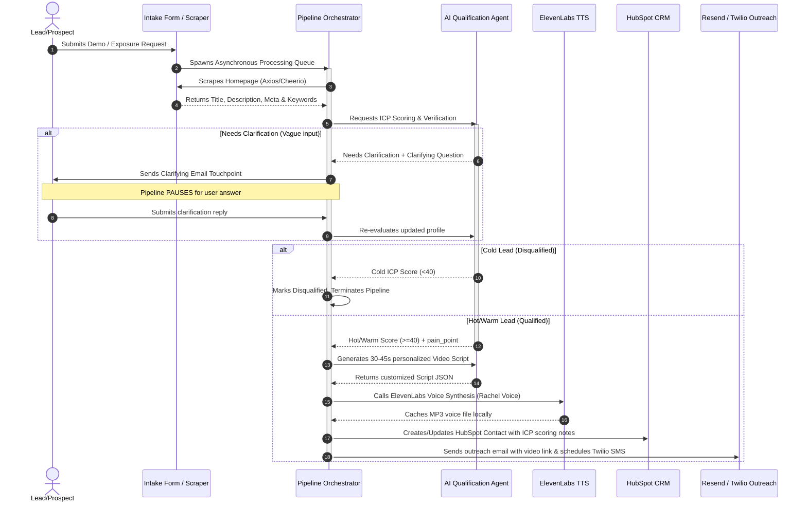

# NymbusGuard: AI-Powered Revenue Operations & Video Personalization Engine

NymbusGuard is a complete, automated inbound pipeline that instantly qualifies B2B cybersecurity leads and drives conversion through hyper-personalized video sales assets. By bridging the gap between external security posture and revenue operations, NymbusGuard turns generic contact form submissions into high-converting, tailored video sales touchpoints.

---

## The Problem
Cybersecurity prospects are fatigued by generic cold emails. Security decision-makers (CISOs, IT Directors, Security Engineers) expect sales representatives to understand their specific attack surfaces and pain points from day one. However, manual research and personalized video creation take hours per lead, making outbound personalization impossible to scale.

## The Solution: NymbusGuard
NymbusGuard automates the entire qualification and personalization lifecycle in under 60 seconds:
1. **Intake & Scanning**: Captures inbound leads through an interactive Attack Surface Scanner simulator.
2. **Automated Site Scrape & Enrichment**: Dynamically scrapes the prospect's company website to extract meta titles, descriptions, and headings to understand their core business.
3. **AI ICP Qualification (SDR Agent)**: Employs a specialized AI agent to qualify leads against a strict Ideal Customer Profile (ICP) rubric, assigning a Fit Score from 0 to 100.
4. **Conversational Clarification Loop**: If the prospect's submitted details or security pain points are vague, NymbusGuard pauses and prompts a context-aware follow-up question to clarify their needs before final scoring.
5. **AI Video Personalization**: Automatically drafts a custom 30-45s outreach script addressing the prospect's role, company, and primary security pain point.
6. **Voiceover Synthesis**: Synthesizes a high-fidelity personalized voiceover to narrate the video preview.
7. **CRM Sync & Multi-Channel Outreach**: Synces qualified contacts to HubSpot and schedules personalized touchpoints via Resend (Email) and Twilio (SMS/WhatsApp).

---

## Core Product Pillars

### 1. Interactive Demo Intake Portal
An interactive frontend portal designed to engage security buyers. Prospects enter their details and run a simulated vulnerability scan that shows real-time subdomains, open ports, and potential data leakage points on their domain.

### 2. Deep-Scrape Website Enrichment
A smart scraping engine that handles root domains and nested URLs (such as personal portfolios or company subdirectories) using headless proxies. It grabs site metadata (titles, descriptions, and major headers) to build a firmographic profile of the company.

### 3. AI SDR Agent & Qualification Rubric
The qualification engine grades every lead based on firmographics and authority:
* **Fit criteria**: Company size, target industries (SaaS, FinTech, Healthcare), geographic availability, and job title alignment.
* **Lead Classification**:
  * **Hot**: High score, decision-maker title, clear security pain point. Schedulers trigger immediate voice synthesis and outbound mail.
  * **Warm**: Moderate alignment, general IT title, or slightly vague pain point.
  * **Cold (Disqualified)**: Competitors, students, personal emails, or tiny companies. The pipeline halts automatically to protect representative bandwidth.

### 4. Interactive Personalized Video Portal
A dynamic, client-side video page tailored for the prospect. It overlays the custom synthesized voiceover with a simulated security assessment script showing their specific domain vulnerabilities.

### 5. Multi-Channel Integrations
* **CRM Sync (HubSpot)**: Automated contact generation and custom property syncing.
* **Outreach Mail (Resend)**: Sends day-0 emails containing the personalized video page link.
* **Mobile Touchpoints (Twilio)**: Sends automated follow-up SMS and WhatsApp messages with a direct CTA to schedule a demo.
